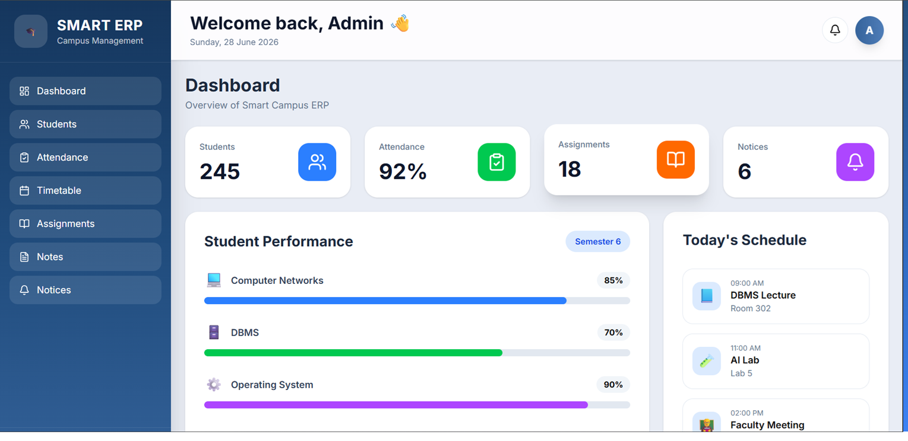
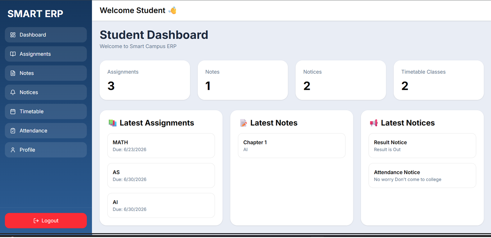

# 🎓 Smart Campus ERP

A modern Smart Campus ERP System built with Next.js 16, Prisma, PostgreSQL, NextAuth, and Tailwind CSS.

## 🚀 Features

### 🔐 Authentication
- Secure Login using NextAuth
- Role Based Authentication
- JWT Session
- Password Hashing with bcrypt

### 👨‍💼 Admin Panel
- Dashboard
- Student Management
- Attendance Management
- Assignments
- Notes
- Notices
- Timetable

### 👨‍🎓 Student Panel
- Dashboard
- View Attendance
- View Assignments
- Notes
- Notices
- Timetable
- Profile

### ☁️ File Upload
- Cloudinary Integration
- Upload Notes
- Upload Attachments

---

# 🛠 Tech Stack

## Frontend

- Next.js 16
- React 19
- TypeScript
- Tailwind CSS
- Lucide Icons

## Backend

- Next.js Server Actions
- NextAuth v5
- Prisma ORM

## Database

- PostgreSQL

## Authentication

- NextAuth
- Credentials Provider
- JWT Session

## Cloud Storage

- Cloudinary

---

# 📂 Folder Structure

```
src
│
├── app
│   ├── admin
│   ├── student
│   ├── api
│   └── login
│
├── actions
├── components
├── lib
├── prisma
├── auth.ts
├── auth.config.ts
└── middleware.ts
```

---

# ⚙️ Installation

Clone the repository

```bash
git clone https://github.com/YOUR_USERNAME/smart-campus-erp.git
```

Go inside project

```bash
cd smart-campus-erp
```

Install dependencies

```bash
npm install
```

Create `.env`

```env
DATABASE_URL=

AUTH_SECRET=

AUTH_URL=http://localhost:3000

CLOUDINARY_CLOUD_NAME=
CLOUDINARY_API_KEY=
CLOUDINARY_API_SECRET=
```

Generate Prisma Client

```bash
npx prisma generate
```

Run migrations

```bash
npx prisma migrate dev
```

Run project

```bash
npm run dev
```

---

# 🔑 Demo Accounts

## Admin

```
Email:
admin@smartcampus.com

Password:
admin123
```

## Student

```
Email:
garv@gmail.com

Password:
457
```

---

# 📸 Screenshots


### Login


### Admin Dashboard



### Student Dashboard



### Attendance


### Notes


### Notices


### Timetable


---

# 🚀 Future Improvements

- Faculty Module
- Parent Portal
- Fee Management
- Online Exams
- Result Management
- Notifications
- AI Assistant
- Chat System
- Analytics Dashboard

---

# 👨‍💻 Author

**Garv Arora**

GitHub:
https://github.com/YOUR_USERNAME

LinkedIn:
https://linkedin.com/in/YOUR_LINKEDIN

---

# 📄 License

This project is licensed under the MIT License.